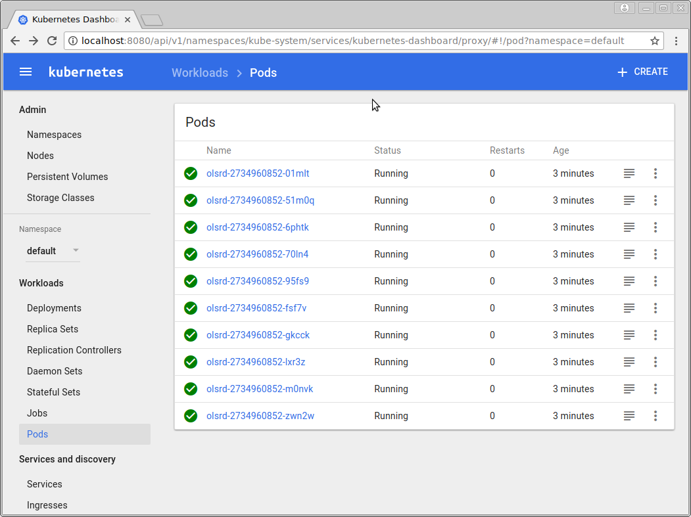
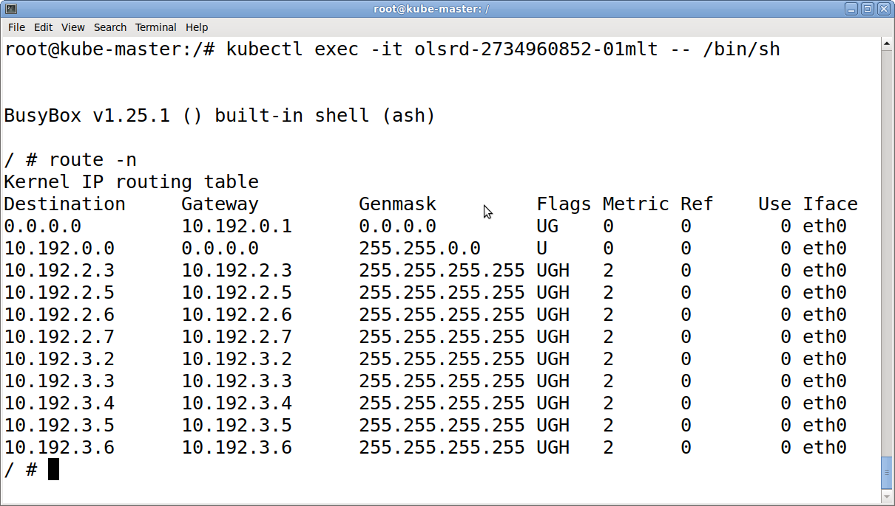

About
=====

Run OLSRD routing daemon inside a docker container.

Why?
====

* Run many olsrd on multiple containers
* Load testing
* Simulations
* Generate packet loss and latency via netem module  
* Etc...

Status
======

Working, all the hosts appear in "route -n" after a while:

```
/ # route -n
Kernel IP routing table
Destination     Gateway         Genmask         Flags Metric Ref    Use Iface
0.0.0.0         172.17.0.1      0.0.0.0         UG    0      0        0 eth0
172.17.0.0      0.0.0.0         255.255.0.0     U     0      0        0 eth0
172.17.0.4      172.17.0.4      255.255.255.255 UGH   2      0        0 eth0
172.17.0.5      172.17.0.5      255.255.255.255 UGH   2      0        0 eth0
172.17.0.6      172.17.0.6      255.255.255.255 UGH   2      0        0 eth0
172.17.0.7      172.17.0.7      255.255.255.255 UGH   2      0        0 eth0
172.17.0.8      172.17.0.8      255.255.255.255 UGH   2      0        0 eth0
```

Pre-built image
===============

If you want to try, here is a oneliner:

```
$ docker run --privileged zoobab/olsrd-in-docker

 *** olsr.org - 0.9.5-git_0000000-hash_0942e9bfb09d8a5cf2ca87e2a7d938c6 ***
 Build date: 2017-02-05 04:01:21 on builds-02.infra.lede-project.org
 http://www.olsr.org

Parsing file: "/etc/olsrd/olsrd.conf"
Debug level: 0
IpVersion: 4
Clear screen enabled
Noint set to 1
Hysteresis enabled
Hysteresis Scaling: 0.50
Hysteresis UpperThr: 0.80
Hysteresis LowerThr: 0.30
Link quality level 0
Pollrate 0.05
NIC Changes Pollrate 3.00
setting ifs_in_curr_cfg = 0
	IPv4 broadcast/multicast : AUTO
	Mode           : mesh
	IPv6 multicast           : ::
	HELLO emission/validity  : 0.00/0.00
	TC emission/validity     : 0.00/0.00
	MID emission/validity    : 0.00/0.00
	HNA emission/validity    : 0.00/0.00
	Autodetect changes       : no

```

Now spawn many of those with the "-d" option:

```
$ for i in 1 2 3 4 5; do docker run -d --privileged zoobab/olsrd-in-docker; done
e3e18c686435c3a43ecd9169784b228c0f9d55f50423bde36a35221f7781b8d4
d7f2e3aab34259c9c99eb233ac6c0ee8c8402b94fa9efab52992ad68737cc81a
241efebfb1b1be90e0a3016692c0c687bc7fa948ffbf9de8b6cc09032bc8f8f6
5f3317de74dd6bbbb80f923d4d78a07276e7ba029c8558e80ba3ea8f20ec3a53
095491eb373d564f5f2674e4c687646dfa88795ab4cbdc5f26c6033c5a2a6b22
```

If you use the dps wrapper script (https://github.com/zoobab/docker-ps-showips), you could display the IP of the container: 

```
$ dps
IP ADDRESS	CONTAINER ID        IMAGE                    COMMAND             CREATED             STATUS              PORTS               NAMES
172.17.0.6	095491eb373d        zoobab/olsrd-in-docker   "olsrd -nofork"     31 seconds ago      Up 25 seconds                           trusting_ramanujan
172.17.0.5	5f3317de74dd        zoobab/olsrd-in-docker   "olsrd -nofork"     32 seconds ago      Up 31 seconds                           eager_haibt
172.17.0.4	241efebfb1b1        zoobab/olsrd-in-docker   "olsrd -nofork"     34 seconds ago      Up 32 seconds                           elated_mestorf
172.17.0.3	d7f2e3aab342        zoobab/olsrd-in-docker   "olsrd -nofork"     39 seconds ago      Up 33 seconds                           competent_lumiere
172.17.0.2	e3e18c686435        zoobab/olsrd-in-docker   "olsrd -nofork"     40 seconds ago      Up 38 seconds                           dazzling_kare
```

Then check that all the hosts are in the routing table:

```
$ docker exec -it 095491eb373d route -n
Kernel IP routing table
Destination     Gateway         Genmask         Flags Metric Ref    Use Iface
0.0.0.0         172.17.0.1      0.0.0.0         UG    0      0        0 eth0
172.17.0.0      0.0.0.0         255.255.0.0     U     0      0        0 eth0
172.17.0.2      172.17.0.2      255.255.255.255 UGH   2      0        0 eth0
172.17.0.3      172.17.0.3      255.255.255.255 UGH   2      0        0 eth0
172.17.0.4      172.17.0.4      255.255.255.255 UGH   2      0        0 eth0
172.17.0.5      172.17.0.5      255.255.255.255 UGH   2      0        0 eth0
```

Run inside Kubernetes cluster
=============================

In the kubernetes web interface, go to:

Pods -> Create -> App name is "olsrd" -> Container image is "zoobab/olsrd-in-docker" -> Replicas is "10" -> Tick "Run as privileged"

Screenshots:



